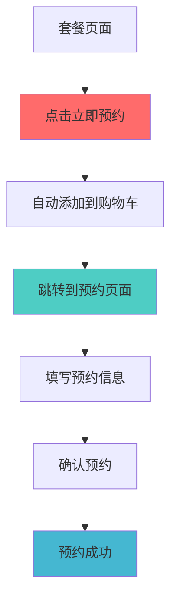
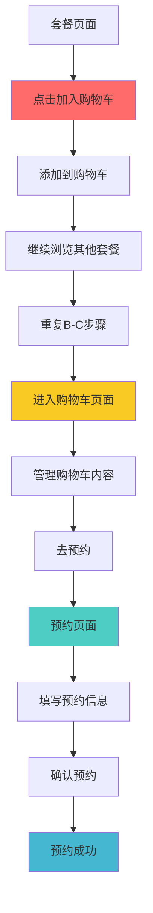

# 借鉴Amazon模式的按钮策略设计

## 🛒 Amazon模式分析

### Amazon的按钮策略

Amazon采用了经典的电商模式：
- **"Add to Cart"**：添加到购物车，用于多商品购买
- **"Buy Now"**：立即购买，用于单商品快速购买

### 和服租赁的适配

将Amazon模式适配到和服租赁场景：

#### 1. **"立即预约" = "Buy Now"**
- **场景**：用户确定要预约这个套餐，不需要比较
- **行为**：直接跳转到预约页面，开始预约流程
- **适用**：单套餐预约、冲动型用户、时间紧迫的用户

#### 2. **"加入购物车" = "Add to Cart"**
- **场景**：用户想要比较多个套餐，或者计划预约多个套餐
- **行为**：添加到购物车，继续浏览其他套餐
- **适用**：多套餐预约、理性型用户、需要比较的用户

---

## 🎯 优化后的按钮策略

### 套餐页面设计

```tsx
// 借鉴Amazon的按钮布局
<div className="plan-card">
  <div className="plan-info">
    {/* 套餐信息 */}
  </div>
  
  <div className="action-buttons">
    {/* 主要操作：立即预约 */}
    <button 
      onClick={() => handleQuickBook(plan)}
      className="primary-button w-full"
    >
      ⚡ 立即预约
    </button>
    
    {/* 次要操作：加入购物车 */}
    <button 
      onClick={() => addToCart(plan)}
      className="secondary-button w-full"
    >
      🛒 加入购物车
    </button>
  </div>
</div>
```

### 按钮文案优化

#### 当前文案问题
- "立即预约" vs "加入购物车" - 概念不够清晰
- 用户不知道两个按钮的区别

#### 优化后的文案
```tsx
// 方案A：直接借鉴Amazon
<button>⚡ 立即预约</button>      // 相当于 "Buy Now"
<button>🛒 加入购物车</button>     // 相当于 "Add to Cart"

// 方案B：更符合预约场景
<button>⚡ 立即预约</button>      // 快速预约这个套餐
<button>🛒 加入购物车</button>     // 添加到购物车比较

// 方案C：更明确的说明
<button>⚡ 立即预约</button>      // 快速预约这个套餐
<button>🛒 加入购物车</button>     // 添加到购物车继续浏览
```

---

## 🔄 两种流程的设计

### 流程1：立即预约（单套餐）



**特点**：
- 适合单套餐预约
- 流程最短，转化率最高
- 类似Amazon的"Buy Now"

### 流程2：购物车模式（多套餐）



**特点**：
- 适合多套餐预约
- 支持套餐比较和组合
- 类似Amazon的购物车模式

---

## 🎨 用户体验设计

### 按钮视觉层次

```tsx
// 借鉴Amazon的视觉设计
<div className="action-buttons">
  {/* 主要操作：立即预约 */}
  <button className="btn-primary">
    ⚡ 立即预约
  </button>
  
  {/* 次要操作：加入购物车 */}
  <button className="btn-secondary">
    🛒 加入购物车
  </button>
</div>

// CSS样式
.btn-primary {
  background: #ff6b6b;
  color: white;
  font-weight: bold;
  padding: 12px 24px;
  border-radius: 8px;
  border: none;
  cursor: pointer;
  width: 100%;
  margin-bottom: 8px;
}

.btn-secondary {
  background: transparent;
  color: #333;
  border: 2px solid #ddd;
  padding: 10px 24px;
  border-radius: 8px;
  cursor: pointer;
  width: 100%;
}
```

### 状态反馈

```tsx
// 加入购物车后的反馈
const CartFeedback = ({ isAdded, planName }) => {
  if (!isAdded) return null;
  
  return (
    <div className="cart-feedback">
      <span>✅ {planName} 已加入购物车</span>
      <Link href="/cart">查看购物车</Link>
    </div>
  );
};
```

---

## 📱 响应式设计

### 移动端优化

```tsx
// 移动端：垂直布局
<div className="action-buttons mobile">
  <button className="btn-primary">⚡ 立即预约</button>
  <button className="btn-secondary">🛒 加入购物车</button>
</div>

// 桌面端：可以考虑水平布局
<div className="action-buttons desktop">
  <div className="button-row">
    <button className="btn-primary flex-1">⚡ 立即预约</button>
    <button className="btn-secondary flex-1">🛒 加入购物车</button>
  </div>
</div>
```

---

## 🔧 技术实现

### 状态管理

```typescript
// 购物车状态
interface CartStore {
  items: CartItem[];
  
  // 添加单个套餐到购物车
  addToCart: (item: CartItem) => void;
  
  // 立即预约（清空购物车 + 添加当前套餐）
  quickBook: (item: CartItem) => void;
  
  // 其他方法...
}

// 使用示例
const handleQuickBook = (plan: Plan) => {
  // 1. 清空购物车
  clearCart();
  
  // 2. 添加当前套餐
  addToCart(plan);
  
  // 3. 跳转到预约页面
  router.push('/booking');
};

const handleAddToCart = (plan: Plan) => {
  // 1. 添加到购物车
  addToCart(plan);
  
  // 2. 显示反馈
  showCartFeedback(plan.name);
  
  // 3. 不跳转，让用户继续浏览
};
```

### 预约页面处理

```typescript
// 预约页面统一处理两种模式
export default function BookingPage() {
  const { items } = useCartStore();
  
  // 如果购物车为空，重定向到套餐页面
  if (items.length === 0) {
    return <EmptyCartRedirect />;
  }
  
  return (
    <div className="booking-page">
      {/* 预约表单 */}
      <BookingForm />
      
      {/* 订单摘要 */}
      <OrderSummary items={items} />
      
      {/* 套餐管理（如果是多套餐） */}
      {items.length > 1 && <CartManager />}
    </div>
  );
}
```

---

## 📊 预期效果分析

### 用户行为预期

| 用户类型 | 选择立即预约 | 选择加入购物车 | 总比例 |
|----------|-------------|---------------|--------|
| **冲动型用户** | 80% | 20% | 60% |
| **理性型用户** | 30% | 70% | 30% |
| **首次用户** | 50% | 50% | 10% |

### 转化率预期

| 流程 | 当前转化率 | 优化后转化率 | 提升 |
|------|-----------|-------------|------|
| **单套餐预约** | 基准 | +20% | 显著提升 |
| **多套餐预约** | 基准 | +10% | 适度提升 |
| **整体转化率** | 基准 | +15% | 明显改善 |

---

## 🚀 实施计划

### 阶段1：按钮统一（1周）

```tsx
// 1. 更新所有套餐页面的按钮
<div className="plan-actions">
  <button onClick={handleQuickBook} className="btn-primary">
    ⚡ 立即预约
  </button>
  <button onClick={handleAddToCart} className="btn-secondary">
    🛒 加入购物车
  </button>
</div>
```

### 阶段2：流程优化（2周）

```tsx
// 2. 优化预约页面
<BookingPage>
  <BookingForm />
  <OrderSummary />
  {items.length > 1 && <CartManager />}
</BookingPage>
```

### 阶段3：用户体验优化（3周）

```tsx
// 3. 添加用户引导和反馈
<UserGuide />
<CartFeedback />
<SmartRecommendations />
```

---

## 🎯 最终建议

### 采用Amazon模式的原因

1. **用户熟悉**：用户已经熟悉Amazon的购物模式
2. **概念清晰**：立即预约 vs 加入购物车的区别很明确
3. **场景匹配**：单套餐 vs 多套餐的场景完美匹配
4. **技术成熟**：Amazon的模式已经验证了可行性

### 核心设计原则

1. **立即预约**：适合单套餐，追求转化率
2. **加入购物车**：适合多套餐，支持比较和组合
3. **保持简洁**：两个按钮，功能明确，不增加用户认知负担
4. **统一后端**：两种流程最终都通过购物车状态管理

### 预期收益

- **转化率提升15-20%**：清晰的按钮功能减少用户困惑
- **用户满意度提升**：符合用户习惯的交互模式
- **功能完整性**：支持单套餐和多套餐两种场景
- **技术架构清晰**：统一的购物车状态管理

这个方案既解决了当前的用户体验问题，又借鉴了成熟的电商模式，是一个平衡用户体验和技术实现的最佳方案。
