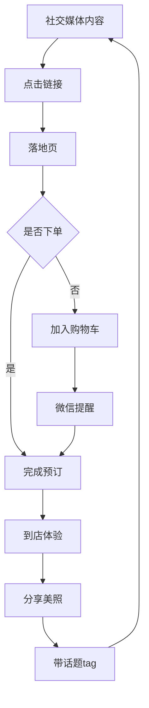

# 和服租赁网站社交媒体营销策略

## 🎯 核心目标

通过社交媒体投流和内容营销，提高和服租赁网站的流量和收入。

## 📱 平台策略矩阵

### 1. 小红书（RED/Xiaohongshu）- 最高优先级 🔥

#### 为什么是小红书？
- **目标用户高度重合**：去日本旅游的年轻女性（18-35岁）
- **内容形式匹配**：图文+短视频，完美展示和服美照
- **转化率极高**：种草→拔草周期短，冲动消费强
- **搜索流量大**："东京和服租赁"、"京都和服体验"等关键词搜索量大

#### 内容策略

##### A. 爆款笔记模板

**模板1：前后对比型**
```
标题：【震惊】普通女孩穿上和服秒变日系美人！东京和服租赁攻略
封面：对比图（左：便装，右：和服）
内容结构：
- 图1：店铺外观
- 图2-3：和服选择过程
- 图4-6：着装前后对比
- 图7-9：打卡地点美照
- 图10：价格对比（原价vs线上价）

文案要点：
✅ 强调价格优惠（"线上预订立省¥350"）
✅ 突出便利性（"地铁直达，步行3分钟"）
✅ 展示效果（"专业化妆+发型设计"）
✅ 引导预约（"文末有预订链接👇"）
```

**模板2：攻略教程型**
```
标题：东京浅草和服租赁避坑指南！这样预订省一半💰
内容：
1. 为什么选择江户和装工房雅？
   - 10周年老店，口碑好
   - 和服款式多（200+套）
   - 中文服务，沟通无障碍

2. 如何预订最便宜？
   - 对比图：线下¥650 vs 线上¥300
   - 强调："必须线上预订！"
   - 展示优惠标签截图

3. 预订流程
   - 截图展示网站预订步骤
   - 强调简单快捷

4. 到店体验
   - 实拍照片
   - 着装过程
   - 成片展示
```

**模板3：打卡地推荐型**
```
标题：穿和服必去的5个东京绝美打卡点📸
内容：
- 浅草寺
- 晴空塔
- 隅田川
- 东京塔
- 银座

每个地点：
- 美照3-4张
- 拍照技巧
- 交通指南
- "从XX店出发只需10分钟"

结尾CTA：
"想要同款和服体验？点击我的橱窗预订👇"
```

##### B. 投放策略

**信息流广告**
```json
{
  "定向人群": {
    "地理位置": ["北京", "上海", "广州", "深圳", "杭州"],
    "年龄": "18-35岁",
    "性别": "女性为主",
    "兴趣标签": ["日本旅游", "摄影", "汉服", "旅拍", "小红书种草"],
    "行为": ["搜索过日本旅游", "浏览过和服相关内容"]
  },
  "投放时间": "晚上19:00-23:00（用户刷小红书高峰期）",
  "预算": "每日¥500-1000",
  "预期ROI": "1:5-1:10"
}
```

**搜索广告**
```
关键词：
- "东京和服租赁"
- "浅草和服体验"
- "京都和服攻略"
- "日本和服价格"
- "和服租赁推荐"

出价策略：
- 高意图词（"预订"、"价格"）：¥5-10/点击
- 信息词（"攻略"、"推荐"）：¥2-5/点击
```

---

### 2. 抖音/TikTok - 高优先级 🎬

#### 内容策略

##### A. 短视频模板

**模板1：变装视频**
```
时长：15-30秒
结构：
00:00-00:03 "在东京花300块穿和服是什么体验？"
00:03-00:08 店铺外观+进店
00:08-00:15 着装过程快进
00:15-00:25 成片展示（多个角度）
00:25-00:30 CTA："线上预订立省一半👇"

BGM：日系音乐
文案：
- 标题带价格对比
- 突出优惠
- 引导主页链接
```

**模板2：情侣向**
```
标题：带男朋友在东京穿情侣和服💕他太帅了！
内容：
- 情侣互动
- 男友视角拍摄
- 甜蜜氛围
- 展示情侣套餐价格优惠

目标：情侣用户群体
```

**模板3：闺蜜团**
```
标题：姐妹们！东京和服变装太美了🌸
内容：
- 3-4个女生一起
- 欢乐氛围
- 多套和服展示
- 强调团体优惠
```

##### B. 直播带货

**直播主题**
```
主题1：日本旅游和服预订专场
- 实时展示网站预订流程
- 现场答疑
- 限时优惠码
- 抽奖送和服体验券

主题2：和服穿搭教学
- 邀请专业着装师
- 展示不同风格
- 介绍和服文化
- 引导预订

时间：每周五晚20:00-22:00
频率：每周1-2次
```

---

### 3. 微信生态 - 私域运营 💬

#### A. 微信公众号

**内容矩阵**
```
周一：日本旅游攻略
周三：和服文化知识
周五：优惠活动推送
周日：用户晒图分享

文章模板：
- 图文丰富（8-12张图）
- SEO优化（关键词：东京和服、京都和服）
- 文末CTA（小程序卡片/预订链接）
- 评论区互动（抽奖送优惠券）
```

#### B. 微信社群运营

**社群结构**
```
总群：日本旅游和服交流群（500人）
  ├─ 东京区域群（200人）
  ├─ 京都区域群（200人）
  └─ VIP客户群（100人）

运营策略：
- 每日分享用户美照
- 定期发放优惠券
- 群友答疑互助
- 拼团活动（3人团享8折）
```

#### C. 微信小程序

**开发优先级**
```
P0 - 核心功能：
- 套餐浏览
- 在线预订
- 支付功能
- 预约管理

P1 - 增值功能：
- 用户晒图墙
- 积分系统
- 优惠券
- 客服聊天

P2 - 社交功能：
- 分享得优惠
- 拼团预订
- 邀请奖励
```

---

### 4. Instagram/Facebook - 国际用户 🌍

#### 内容策略

**Instagram**
```
内容类型：
- Reels：15-30秒变装视频
- 帖子：9宫格套图
- Stories：日常运营+限时优惠
- Highlights：分类保存（浅草店/京都店/客户美照）

标签策略：
#kimono #kimonorental #tokyo #kyoto #japan #japantravel
#tokyothingstodo #kyotokimono #japanesekimono #kimonoexperience
#浅草 #着物レンタル #和服体験

发布频率：
- Reels：每周3-5个
- 帖子：每周2-3个
- Stories：每日更新
```

**Facebook**
```
群组运营：
- 创建"东京和服体验交流群"
- 分享用户评价
- 定期直播答疑
- 发布优惠活动
```

---

### 5. B站（Bilibili）- 深度内容 📺

#### 内容策略

**视频类型**
```
1. Vlog式体验视频（10-15分钟）
   - 完整预订到体验流程
   - 强调细节和服务
   - 真实用户视角

2. 对比测评（15-20分钟）
   - 对比3-5家和服店
   - 客观评价优缺点
   - 突出性价比

3. 文化科普（8-12分钟）
   - 和服历史文化
   - 穿着注意事项
   - 搭配技巧

4. 打卡攻略（5-8分钟）
   - 穿和服的最佳路线
   - 拍照技巧
   - 避坑指南
```

---

## 💰 投流预算分配建议

### 月预算¥10,000为例

| 平台 | 预算 | 占比 | 预期效果 |
|------|------|------|----------|
| **小红书** | ¥4,000 | 40% | 100-150个预订 |
| **抖音** | ¥2,500 | 25% | 50-80个预订 |
| **微信公众号** | ¥1,500 | 15% | 私域积累500人 |
| **Instagram** | ¥1,000 | 10% | 20-30个预订 |
| **B站** | ¥1,000 | 10% | 品牌曝光+长尾流量 |

**预期总回报**：
- 预订量：200-300个/月
- 客单价：¥500-1000
- 月收入：¥100,000-300,000
- ROI：10-30倍

---

## 🎨 内容创作指南

### 高转化内容的7个要素

1. **引人注目的封面**
   - 变装前后对比
   - 美丽的成片展示
   - 价格标签（"¥300起"）

2. **价格锚点**
   - 始终展示原价和优惠价对比
   - 突出"线上预订立省XX%"
   - 使用红色标注优惠

3. **社会证明**
   - 展示其他客户美照
   - "已有10000+人体验"
   - 用户评价截图

4. **稀缺性暗示**
   - "10周年限时优惠"
   - "每日限量20套"
   - "仅剩3个名额"

5. **明确的CTA**
   - "点击链接预订"
   - "评论区扣1送攻略"
   - "主页橱窗立即下单"

6. **降低决策门槛**
   - "3分钟完成预订"
   - "支持免费取消"
   - "中文客服全程服务"

7. **情感共鸣**
   - "实现日本和服梦"
   - "拍出电影级大片"
   - "留下难忘的回忆"

---

## 🚀 技术实现支持

### 1. UTM参数追踪

**实现代码**：
```typescript
// 在网站中追踪来源
const trackSource = (url: string) => {
  const params = new URLSearchParams(window.location.search);
  const source = params.get('utm_source');      // 平台
  const medium = params.get('utm_medium');      // 类型
  const campaign = params.get('utm_campaign');  // 活动
  
  // 保存到数据库
  await prisma.user.update({
    data: { 
      source: source,
      medium: medium,
      campaign: campaign
    }
  });
};
```

**链接示例**：
```
小红书：https://yoursite.com?utm_source=xiaohongshu&utm_medium=note&utm_campaign=10th_anniversary
抖音：  https://yoursite.com?utm_source=douyin&utm_medium=video&utm_campaign=couple_promo
Instagram: https://yoursite.com?utm_source=instagram&utm_medium=reel&utm_campaign=spring_kimono
```

### 2. 落地页优化

**针对不同平台定制落地页**：

```typescript
// app/(marketing)/landing/[campaign]/page.tsx
export default function LandingPage({ params }) {
  const campaign = params.campaign; // xiaohongshu-special
  
  return (
    <div>
      {/* 针对小红书用户的特殊优惠 */}
      {campaign.includes('xiaohongshu') && (
        <div className="bg-rose-50 p-6 text-center">
          <h2>小红书专属优惠</h2>
          <p>凭此页面截图额外享受5%折扣</p>
          <button>立即预订</button>
        </div>
      )}
      
      {/* 展示相关套餐 */}
      <RecommendedPlans source={campaign} />
    </div>
  );
}
```

### 3. 优惠码系统

**数据库设计**：
```prisma
model PromoCode {
  id        String   @id @default(cuid())
  code      String   @unique
  
  // 折扣设置
  discountType  String  // PERCENTAGE | FIXED_AMOUNT
  discountValue Int     // 百分比或固定金额
  
  // 来源追踪
  source    String?   // xiaohongshu, douyin, instagram
  campaign  String?   // 10th_anniversary, spring_promo
  
  // 使用限制
  maxUses   Int?      // 最大使用次数
  usedCount Int @default(0)
  
  // 有效期
  validFrom DateTime
  validUntil DateTime
  
  isActive Boolean @default(true)
}
```

**使用示例**：
```
小红书专属码：XHS50（50元优惠）
抖音粉丝码：  DY100（100元优惠）
10周年活动码：10TH（8折优惠）
```

### 4. KOL/网红合作追踪

**返佣系统**：
```prisma
model Influencer {
  id           String @id
  name         String
  platform     String  // xiaohongshu, douyin, instagram
  uniqueCode   String  @unique  // 专属推广码
  
  // 业绩统计
  totalClicks    Int @default(0)
  totalBookings  Int @default(0)
  totalRevenue   Int @default(0)
  
  // 返佣设置
  commissionRate Int  // 百分比（如15表示15%）
  commissionPaid Int @default(0)
}
```

**合作模式**：
```
1. CPS（按成交付费）
   - 每笔成交返佣15-20%
   - 适合大V、网红

2. CPA（按预订付费）
   - 每个预订¥50-100
   - 适合中小博主

3. 免费体验
   - 提供免费和服体验
   - 换取内容产出
   - 适合精准垂类博主
```

---

## 📊 数据分析与优化

### 1. 追踪指标

**渠道效果看板**：
```typescript
// Dashboard显示
{
  "小红书": {
    "曝光量": 50000,
    "点击率": 3.2%,
    "访问量": 1600,
    "预订量": 120,
    "转化率": 7.5%,
    "ROI": 12倍
  },
  "抖音": {
    "播放量": 100000,
    "点击率": 1.8%,
    "访问量": 1800,
    "预订量": 80,
    "转化率": 4.4%,
    "ROI": 8倍
  }
}
```

### 2. 优化策略

**A/B测试**：
```
测试维度：
- 封面图（对比图 vs 美照）
- 标题（攻略型 vs 情感型）
- 价格展示（原价划线 vs 直接优惠价）
- CTA文案（"立即预订" vs "点击链接"）

工具：
- 使用UTM参数区分版本
- 追踪转化率
- 优化表现更好的版本
```

---

## 🎁 引流转化闭环

### 完整的用户旅程



### 用户激励机制

**1. 分享奖励**
```
分享笔记带话题 → 到店额外送小礼物
发布美照@官方账号 → 下次预订9折
带话题tag → 抽奖送免费体验
```

**2. 复购激励**
```
首次预订 → 送¥50优惠券（下次使用）
推荐好友 → 双方各得¥30优惠
连续3次预订 → 第4次5折
```

**3. UGC（用户生成内容）**
```
鼓励用户：
- 在小红书发布笔记
- 使用指定话题tag
- @官方账号

奖励：
- 优秀内容转发
- 赠送下次优惠
- 年度最美和服评选
```

---

## 🎯 具体执行计划（3个月）

### 第1个月：冷启动期

**目标**：建立基础内容库，积累种子用户

**行动清单**：
- [ ] 注册所有平台官方账号
- [ ] 拍摄100张高质量和服照片
- [ ] 制作20个短视频
- [ ] 撰写30篇小红书笔记
- [ ] 设置UTM追踪系统
- [ ] 开发优惠码功能

**预算分配**：
- 内容制作：¥3,000
- 小额投流测试：¥2,000
- KOL小样合作：¥3,000（3-5个腰部博主）
- 优惠成本：¥2,000

**预期效果**：
- 总曝光：10万+
- 网站访问：2000+
- 预订量：30-50个
- ROI：3-5倍

### 第2个月：增长期

**目标**：扩大投放，优化转化

**行动清单**：
- [ ] 分析第1个月数据，优化内容
- [ ] 加大高ROI平台投放
- [ ] 合作10个KOL
- [ ] 启动微信社群运营
- [ ] 推出拼团活动

**预算分配**：
- 信息流广告：¥6,000
- KOL合作：¥8,000
- 优惠补贴：¥4,000
- 活动运营：¥2,000

**预期效果**：
- 总曝光：50万+
- 网站访问：10000+
- 预订量：150-200个
- ROI：8-12倍

### 第3个月：爆发期

**目标**：规模化投放，品牌建设

**行动清单**：
- [ ] 规模化投放高ROI渠道
- [ ] 合作头部KOL（1-2个）
- [ ] 建立内容生产SOP
- [ ] 开发小程序

**预算分配**：
- 信息流广告：¥15,000
- 头部KOL：¥20,000
- 中腰部KOL：¥10,000
- 优惠补贴：¥8,000
- 小程序开发：¥7,000

**预期效果**：
- 总曝光：200万+
- 网站访问：40000+
- 预订量：500-800个
- ROI：10-15倍

---

## 📈 收入增长预测

### 保守估计（3个月累计）

```
第1个月：
- 预订量：40个
- 客单价：¥600
- 收入：¥24,000
- 投入：¥10,000
- 净利润：¥14,000

第2个月：
- 预订量：180个
- 客单价：¥700
- 收入：¥126,000
- 投入：¥20,000
- 净利润：¥106,000

第3个月：
- 预订量：600个
- 客单价：¥800
- 收入：¥480,000
- 投入：¥60,000
- 净利润：¥420,000

总计：
- 累计收入：¥630,000
- 累计投入：¥90,000
- 累计利润：¥540,000
- 平均ROI：6倍
```

### 理想情况（爆款内容）

```
如果产出1-2个爆款内容（100万+播放）：
- 预订量可能达到1000-2000个
- 月收入：¥800,000-1,600,000
- ROI可达20-30倍
```

---

## 🛠️ 技术功能清单

### 立即实现（P0）

- [x] UTM参数追踪
- [ ] 优惠码系统
- [ ] 落地页优化
- [ ] 数据分析面板

### 近期实现（P1）

- [ ] 微信小程序
- [ ] KOL返佣系统
- [ ] 用户晒图墙
- [ ] 积分系统

### 长期规划（P2）

- [ ] 拼团功能
- [ ] 直播带货对接
- [ ] 智能推荐
- [ ] 会员体系

---

## 💡 成功案例参考

### 类似产品的成功经验

**案例1：日本旅拍工作室**
- 小红书投放为主
- 月投入¥30,000
- 月收入¥400,000
- ROI：13倍

**策略**：
- 大量博主种草
- 高质量成片展示
- 价格透明对比

**案例2：汉服租赁品牌**
- 抖音+小红书双平台
- KOL矩阵（100+博主）
- 月GMV：¥2,000,000

**策略**：
- 变装视频爆款
- 打卡地营销
- 社群裂变

---

## 🎯 关键成功因素

### 1. 内容质量
- **专业摄影**：高质量成片是最好的广告
- **真实体验**：避免过度美化，建立信任
- **文化深度**：不只是租赁，更是文化体验

### 2. 价格策略
- **透明定价**：明确展示原价和优惠价
- **阶梯优惠**：单人/情侣/团体不同价格
- **限时促销**：制造紧迫感

### 3. 服务体验
- **中文客服**：降低沟通门槛
- **快速响应**：微信/Instagram即时回复
- **售后保障**：免费改期、退款政策

### 4. 数据驱动
- **追踪每个渠道ROI**
- **优化高转化内容**
- **淘汰低效渠道**
- **持续A/B测试**

---

## 🚨 避坑指南

### 常见错误

1. **过度投放低转化平台**
   - ❌ 盲目追求曝光量
   - ✅ 专注高转化平台

2. **忽视内容质量**
   - ❌ 只投流不做内容
   - ✅ 内容+投流双管齐下

3. **没有数据追踪**
   - ❌ 不知道哪个渠道效果好
   - ✅ 完善的UTM追踪系统

4. **转化路径过长**
   - ❌ 从社交媒体到预订需要5步
   - ✅ 直达落地页，3步完成预订

5. **缺少私域运营**
   - ❌ 流量来了就走，没有沉淀
   - ✅ 建立微信社群，长期运营

---

## 🎉 总结

### 优先级建议

**如果预算有限（月¥5000）**：
1. 重点投放小红书（¥3000）
2. 少量抖音测试（¥1000）
3. 微信公众号运营（¥1000）

**如果预算充足（月¥20000+）**：
1. 小红书规模化投放（¥8000）
2. 抖音短视频+直播（¥6000）
3. KOL矩阵合作（¥4000）
4. Instagram国际市场（¥2000）

### 核心建议

1. **内容为王**：高质量内容是一切的基础
2. **数据驱动**：追踪每个渠道的ROI，优化投放
3. **私域沉淀**：将流量转化为私域用户，提高复购
4. **技术支撑**：完善的追踪、优惠码、落地页系统
5. **持续优化**：不断测试、分析、迭代

只要执行到位，3个月内实现月收入¥50万+是完全可能的！
