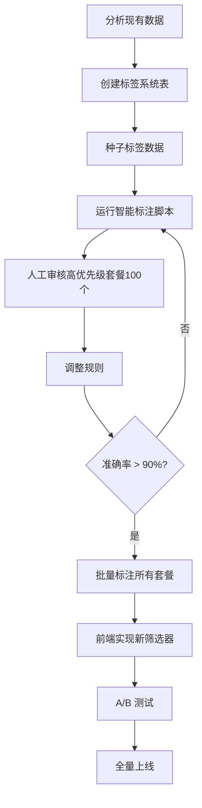

# 和服租赁套餐数据模型重设计方案

> **文档日期**: 2025-11-02
> **目标**: 解决"选择困难"问题,围绕"标准化套餐"打磨预约流程,让游客更容易快速决策

---

## 📋 目录

1. [核心问题分析](#核心问题分析)
2. [现有系统架构总结](#现有系统架构总结)
3. [游客决策心理模型](#游客决策心理模型)
4. [新的筛选维度设计](#新的筛选维度设计)
5. [数据模型重设计方案](#数据模型重设计方案)
6. [前端筛选器设计](#前端筛选器设计)
7. [数据迁移策略](#数据迁移策略)
8. [实施路线图](#实施路线图)
9. [待讨论决策点](#待讨论决策点)

---

## 核心问题分析

### 问题陈述

> "我去麦当劳能够很快决定要吃鸡腿汉堡、牛肉汉堡或者鸡块套餐,但是和服套餐每个看上去都差不多。"

**根本原因**:
- 游客没有时间、精力和耐性去筛选和定制和服套餐
- 商家没有时间、精力和方法来管理种类繁多的库存和预约
- **缺少明确的差异化决策维度**

### 当前决策路径对比

**麦当劳决策 (3秒)**:
```
我想吃什么? → 鸡肉/牛肉/鱼 → 价格 → 完成
        ↓
    明确差异化
```

**当前和服租赁决策 (30分钟?)**:
```
我想租什么? → 看分类(女士/男士/情侣...) → 看300个套餐 → ???
        ↓
    全是照片 + 价格 + "包含服务"
    ↓
  看不出差异!
```

### 现有筛选维度的问题

| 筛选维度 | 对游客有用吗? | 问题 |
|---------|--------------|------|
| **地区** (region) | ✅ 有用 | 但放在第一位不合理 |
| **店铺** (storeName) | ⚠️ 中性 | 游客不关心哪家店,只关心位置 |
| **分类** (category) | ⚠️ 部分有用 | LADIES/MENS 太宽泛,SPECIAL 无意义 |
| **标签** (tags) | ❌ 无用 | 杂乱无章,没有统一标准 |
| **活动** (isCampaign) | ⚠️ 促销意义 | 不是决策维度 |
| **价格** | ✅ 有用 | 但没有价格区间筛选器! |

**核心问题**: 缺少**体验维度**的差异化!

---

## 现有系统架构总结

### 核心数据模型

#### RentalPlan (统一套餐模型)

```prisma
model RentalPlan {
  // 基础信息
  id            String   @id @default(cuid())
  slug          String   @unique
  name          String
  nameEn        String?
  description   String
  category      PlanCategory  // LADIES/MENS/COUPLE/FAMILY/GROUP/SPECIAL

  // 价格（单位：分）
  price         Int           // 实际销售价格
  originalPrice Int?          // 线下原价（用于显示优惠）
  depositAmount Int @default(0)

  // 服务信息
  duration      Int           // 租赁时长（小时）
  includes      String[]      // 包含项目列表
  imageUrl      String?

  // 店铺和地区信息
  storeName     String?
  region        String?
  tags          String[] @default([])

  // 活动关联
  campaignId    String?
  campaign      Campaign? @relation(fields: [campaignId], references: [id])

  // 活动特性标记
  isCampaign      Boolean @default(false)
  isLimited       Boolean @default(false)
  maxBookings     Int?
  currentBookings Int @default(0)

  // 时间限制
  availableFrom  DateTime?
  availableUntil DateTime?

  // 状态控制
  isActive   Boolean @default(true)
  isFeatured Boolean @default(false)

  createdAt DateTime @default(now())
  updatedAt DateTime @updatedAt

  // 关系
  bookingItems BookingItem[]
  cartItems    CartItem[]
}
```

### 现有架构问题

1. **数据模型冗余**: RentalPlan 和 CampaignPlan 并存,迁移未完成
2. **Kimono 和 RentalPlan 关系不明确**: 无法在预订时选择具体和服款式
3. **多店铺预订复杂性**: 同一预订可以有不同店铺,用户体验混乱
4. **店铺筛选逻辑不准确**: 使用字符串 `includes` 匹配而非外键关系
5. **缺少库存管理**: 没有日期级别的可用性检查
6. **时间字段设计不合理**: `visitTime` 存储为字符串
7. **套餐分类逻辑不灵活**: 硬编码枚举,无法动态扩展
8. **价格和定金逻辑未实现**: 定金始终为 0,无支付流程

### 关键文件路径

**数据模型**:
- `prisma/schema.prisma` - 数据库 schema

**前端页面**:
- `src/app/(main)/plans/page.tsx` - 套餐列表
- `src/app/(main)/plans/PlansClient.tsx` - 客户端筛选
- `src/app/(main)/plans/[id]/page.tsx` - 套餐详情
- `src/app/(main)/cart/page.tsx` - 购物车
- `src/app/(main)/booking/page.tsx` - 结算页

**组件**:
- `src/components/PlanCard.tsx` - 套餐卡片
- `src/components/BookingCard.tsx` - 预订卡片

**状态管理**:
- `src/store/cart.ts` - 购物车状态

**API**:
- `src/app/api/bookings/route.ts` - 预订 API
- `src/app/api/plans/[id]/route.ts` - 套餐详情 API

**数据脚本**:
- `scripts/import-unified-plans.ts` - 导入脚本
- `data/real-plans-data.json` - 常规套餐数据 (967个)
- `data/real-campaigns-data.json` - 活动套餐数据

---

## 游客决策心理模型

### 游客真正关心的决策维度

#### 1. 使用场景 (最重要!)

游客预订和服是为了:

```typescript
enum ExperienceScene {
  CASUAL_WALK = 'casual_walk',      // 随便逛逛拍照
  TEMPLE_VISIT = 'temple_visit',    // 寺庙参拜
  FESTIVAL = 'festival',            // 祭典活动
  WEDDING_GUEST = 'wedding_guest',  // 参加婚礼
  PHOTOSHOOT = 'photoshoot',        // 专业写真
  DATE = 'date',                    // 约会
  FAMILY_TRIP = 'family_trip',      // 家庭出游
}
```

**为什么重要?**
- 不同场景对和服的**正式度**、**舒适度**、**价格**要求完全不同
- 游客脑海里的第一个问题是"我要干嘛?"而非"我要租什么类型的和服?"

#### 2. 时长需求

```typescript
enum DurationPreference {
  SHORT = '2-3小时',   // 快速体验
  HALF_DAY = '4-6小时', // 半日游
  FULL_DAY = '8小时+',  // 全日游
  OVERNIGHT = '过夜',   // 特殊场景
}
```

**当前问题**:
- 所有套餐都有 `duration` 字段,但游客**无法按时长筛选**
- 需要手动点开每个套餐查看

#### 3. 预算区间 (而非具体价格)

```typescript
enum PriceRange {
  BUDGET = '¥200以下',      // 经济型
  STANDARD = '¥200-400',   // 标准型
  PREMIUM = '¥400-600',    // 高级型
  LUXURY = '¥600+',        // 豪华型
}
```

**当前问题**:
- 价格以"分"存储,前端没有价格区间筛选器
- 游客需要滚动所有套餐比较价格

#### 4. 风格/主题

```typescript
enum KimonoStyle {
  TRADITIONAL = 'traditional',  // 传统古典
  MODERN = 'modern',           // 时尚现代
  ELEGANT = 'elegant',         // 优雅端庄
  CUTE = 'cute',               // 可爱甜美
  LUXURIOUS = 'luxurious',     // 华丽奢华
  SIMPLE = 'simple',           // 简约素雅
}
```

**当前问题**:
- 没有风格标签系统
- `tags` 字段杂乱无章,没有标准化

#### 5. 适合人群 (更精细的分类)

```typescript
enum TargetAudience {
  YOUNG_WOMAN = 'young_woman',       // 年轻女性(18-25)
  MATURE_WOMAN = 'mature_woman',     // 成熟女性(26-40)
  YOUNG_MAN = 'young_man',           // 年轻男性
  MATURE_MAN = 'mature_man',         // 成熟男性
  COUPLE = 'couple',                 // 情侣
  FAMILY_WITH_KIDS = 'family_kids',  // 亲子家庭
  SENIORS = 'seniors',               // 老年人
  PLUS_SIZE = 'plus_size',           // 大码友好
}
```

**为什么重要?**
- 当前的 `category` 只有 LADIES/MENS,太粗糙
- 不同年龄段对和服款式的需求差异巨大

#### 6. 包含服务等级

```typescript
enum ServiceLevel {
  BASIC = 'basic',           // 基础：和服+配件
  STANDARD = 'standard',     // 标准：+发型设计
  PREMIUM = 'premium',       // 高级：+化妆+摄影
  VIP = 'vip',              // VIP：+专属顾问+修图
}
```

**当前问题**:
- `includes` 是字符串数组,无法标准化比较
- 游客无法快速识别"这个套餐比那个套餐多了什么"

#### 7. 便利性因素

```typescript
interface ConvenienceFeatures {
  freeParking: boolean;        // 免费停车
  nearStation: boolean;        // 地铁站附近
  englishSupport: boolean;     // 英文服务
  wheelchairAccessible: boolean; // 无障碍通道
  changeRoomPrivate: boolean;  // 独立更衣室
  luggageStorage: boolean;     // 行李寄存
  lastMinuteBooking: boolean;  // 支持临时预约
}
```

**当前问题**:
- 这些信息散落在 `description` 文本中
- 无法筛选和对比

---

## 新的筛选维度设计

### 推荐的决策维度优先级

| 优先级 | 维度 | 重要性 | 当前支持 | 改进难度 |
|--------|------|--------|----------|----------|
| **P0** | 使用场景 | ⭐⭐⭐⭐⭐ | ❌ | 中 |
| **P0** | 价格区间 | ⭐⭐⭐⭐⭐ | ❌ | 低 |
| **P0** | 服务等级 | ⭐⭐⭐⭐⭐ | ❌ | 中 |
| **P1** | 租赁时长 | ⭐⭐⭐⭐ | ⚠️ (有字段但无筛选) | 低 |
| **P1** | 风格主题 | ⭐⭐⭐⭐ | ❌ | 中 |
| **P1** | 适合人群 | ⭐⭐⭐⭐ | ⚠️ (category太粗糙) | 中 |
| **P2** | 地区位置 | ⭐⭐⭐ | ✅ | - |
| **P2** | 便利性特性 | ⭐⭐⭐ | ❌ | 高 |
| **P2** | 活动促销 | ⭐⭐ | ✅ | - |

---

## 数据模型重设计方案

### 方案A: 最小改动 (快速MVP)

在现有 `RentalPlan` 模型上增加标准化字段:

```prisma
model RentalPlan {
  // ... 保留现有字段 ...

  // 新增决策维度
  scene           ExperienceScene[]  @default([])  // 适用场景
  style           KimonoStyle[]      @default([])  // 风格标签
  targetAudience  TargetAudience[]   @default([])  // 适合人群
  serviceLevel    ServiceLevel                     // 服务等级

  // 便利性特性
  features        Json?  // 存储 ConvenienceFeatures

  // 优化现有字段
  priceRange      PriceRange  // 冗余字段,方便筛选
  durationRange   DurationPreference  // 冗余字段

  // 关联店铺(修复现有问题)
  storeId         String?
  store           Store? @relation(fields: [storeId])

  @@index([scene])
  @@index([priceRange])
  @@index([style])
  @@index([serviceLevel])
}

// 枚举定义
enum ExperienceScene {
  CASUAL_WALK
  TEMPLE_VISIT
  FESTIVAL
  WEDDING_GUEST
  PHOTOSHOOT
  DATE
  FAMILY_TRIP
}

enum KimonoStyle {
  TRADITIONAL
  MODERN
  ELEGANT
  CUTE
  LUXURIOUS
  SIMPLE
}

enum ServiceLevel {
  BASIC
  STANDARD
  PREMIUM
  VIP
}

enum PriceRange {
  BUDGET      // ¥200以下
  STANDARD    // ¥200-400
  PREMIUM     // ¥400-600
  LUXURY      // ¥600+
}

enum DurationPreference {
  SHORT       // 2-3小时
  HALF_DAY    // 4-6小时
  FULL_DAY    // 8小时+
  OVERNIGHT   // 过夜
}

enum TargetAudience {
  YOUNG_WOMAN
  MATURE_WOMAN
  YOUNG_MAN
  MATURE_MAN
  COUPLE
  FAMILY_WITH_KIDS
  SENIORS
  PLUS_SIZE
}
```

**优点**:
- ✅ 改动小,兼容现有数据
- ✅ 可以通过脚本迁移现有套餐
- ✅ 立即支持新筛选维度
- ✅ 查询性能好(枚举字段+索引)

**缺点**:
- ❌ 部分字段冗余(如 priceRange 可以从 price 计算)
- ❌ 枚举类型不够灵活,增加新值需要迁移
- ❌ 国际化支持困难

---

### 方案B: 标签系统重构 (推荐)

引入标准化的标签分类系统:

```prisma
// 标签分类主表
model TagCategory {
  id          String @id @default(cuid())
  code        String @unique  // 'scene', 'style', 'audience' 等
  name        String
  nameEn      String?
  description String?
  order       Int @default(0)
  isRequired  Boolean @default(false)  // 是否必选

  tags        Tag[]

  createdAt   DateTime @default(now())
  updatedAt   DateTime @updatedAt
}

// 标签表
model Tag {
  id          String @id @default(cuid())
  categoryId  String
  code        String
  name        String
  nameEn      String?
  icon        String?  // Lucide icon name
  description String?
  order       Int @default(0)

  category    TagCategory @relation(fields: [categoryId], references: [id])
  plans       PlanTag[]

  createdAt   DateTime @default(now())
  updatedAt   DateTime @updatedAt

  @@unique([categoryId, code])
  @@index([categoryId])
}

// 套餐-标签关联表(多对多)
model PlanTag {
  id     String @id @default(cuid())
  planId String
  tagId  String

  plan   RentalPlan @relation(fields: [planId], references: [id], onDelete: Cascade)
  tag    Tag @relation(fields: [tagId], references: [id], onDelete: Cascade)

  createdAt DateTime @default(now())

  @@unique([planId, tagId])
  @@index([planId])
  @@index([tagId])
}

// 简化后的 RentalPlan
model RentalPlan {
  id            String @id @default(cuid())
  slug          String @unique
  name          String
  nameEn        String?
  description   String
  price         Int
  originalPrice Int?
  duration      Int
  includes      Json  // 结构化服务列表
  imageUrl      String?

  // 关联
  storeId       String
  store         Store @relation(fields: [storeId], references: [id])
  tags          PlanTag[]

  // 元数据
  isActive      Boolean @default(true)
  isFeatured    Boolean @default(false)
  priority      Int @default(0)

  // 活动相关
  campaignId    String?
  campaign      Campaign? @relation(fields: [campaignId], references: [id])

  createdAt     DateTime @default(now())
  updatedAt     DateTime @updatedAt

  // 关系
  bookingItems  BookingItem[]
  cartItems     CartItem[]

  @@index([storeId])
  @@index([price])
  @@index([duration])
  @@index([campaignId])
}
```

**种子数据示例**:

```typescript
// scripts/seed-tag-system.ts
const tagCategories = [
  {
    code: 'scene',
    name: '使用场景',
    nameEn: 'Scene',
    isRequired: true,
    order: 1,
    tags: [
      { code: 'casual_walk', name: '街拍漫步', nameEn: 'Casual Walk', icon: 'Camera', order: 1 },
      { code: 'temple_visit', name: '寺庙参拜', nameEn: 'Temple Visit', icon: 'Church', order: 2 },
      { code: 'festival', name: '祭典活动', nameEn: 'Festival', icon: 'PartyPopper', order: 3 },
      { code: 'photoshoot', name: '专业写真', nameEn: 'Photoshoot', icon: 'CameraIcon', order: 4 },
      { code: 'date', name: '浪漫约会', nameEn: 'Date', icon: 'Heart', order: 5 },
      { code: 'wedding', name: '参加婚礼', nameEn: 'Wedding Guest', icon: 'Users', order: 6 },
      { code: 'family', name: '家庭出游', nameEn: 'Family Trip', icon: 'Home', order: 7 },
    ],
  },
  {
    code: 'style',
    name: '风格',
    nameEn: 'Style',
    order: 2,
    tags: [
      { code: 'traditional', name: '传统古典', nameEn: 'Traditional', icon: 'Landmark', order: 1 },
      { code: 'modern', name: '时尚现代', nameEn: 'Modern', icon: 'Sparkles', order: 2 },
      { code: 'elegant', name: '优雅端庄', nameEn: 'Elegant', icon: 'Crown', order: 3 },
      { code: 'cute', name: '可爱甜美', nameEn: 'Cute', icon: 'Smile', order: 4 },
      { code: 'luxurious', name: '华丽奢华', nameEn: 'Luxurious', icon: 'Gem', order: 5 },
      { code: 'simple', name: '简约素雅', nameEn: 'Simple', icon: 'Minimize', order: 6 },
    ],
  },
  {
    code: 'price_range',
    name: '价格区间',
    nameEn: 'Price Range',
    isRequired: true,
    order: 3,
    tags: [
      { code: 'budget', name: '经济型 ¥200以下', nameEn: 'Budget (Under ¥200)', order: 1 },
      { code: 'standard', name: '标准型 ¥200-400', nameEn: 'Standard (¥200-400)', order: 2 },
      { code: 'premium', name: '高级型 ¥400-600', nameEn: 'Premium (¥400-600)', order: 3 },
      { code: 'luxury', name: '豪华型 ¥600+', nameEn: 'Luxury (¥600+)', order: 4 },
    ],
  },
  {
    code: 'service_level',
    name: '服务等级',
    nameEn: 'Service Level',
    isRequired: true,
    order: 4,
    tags: [
      { code: 'basic', name: '基础版（和服+配件）', nameEn: 'Basic', order: 1 },
      { code: 'standard', name: '标准版（+发型设计）', nameEn: 'Standard', order: 2 },
      { code: 'premium', name: '高级版（+化妆）', nameEn: 'Premium', order: 3 },
      { code: 'vip', name: 'VIP版（+摄影+修图）', nameEn: 'VIP', order: 4 },
    ],
  },
  {
    code: 'duration',
    name: '租赁时长',
    nameEn: 'Duration',
    order: 5,
    tags: [
      { code: 'short', name: '2-3小时', nameEn: '2-3 hours', order: 1 },
      { code: 'half_day', name: '4-6小时', nameEn: '4-6 hours', order: 2 },
      { code: 'full_day', name: '8小时+', nameEn: '8+ hours', order: 3 },
      { code: 'overnight', name: '过夜', nameEn: 'Overnight', order: 4 },
    ],
  },
  {
    code: 'audience',
    name: '适合人群',
    nameEn: 'Target Audience',
    order: 6,
    tags: [
      { code: 'young_woman', name: '年轻女性(18-25)', nameEn: 'Young Woman', order: 1 },
      { code: 'mature_woman', name: '成熟女性(26-40)', nameEn: 'Mature Woman', order: 2 },
      { code: 'young_man', name: '年轻男性', nameEn: 'Young Man', order: 3 },
      { code: 'mature_man', name: '成熟男性', nameEn: 'Mature Man', order: 4 },
      { code: 'couple', name: '情侣', nameEn: 'Couple', order: 5 },
      { code: 'family', name: '亲子家庭', nameEn: 'Family with Kids', order: 6 },
      { code: 'seniors', name: '老年人', nameEn: 'Seniors', order: 7 },
      { code: 'plus_size', name: '大码友好', nameEn: 'Plus Size', order: 8 },
    ],
  },
  {
    code: 'convenience',
    name: '便利性',
    nameEn: 'Convenience',
    order: 7,
    tags: [
      { code: 'near_station', name: '地铁站附近', nameEn: 'Near Station', icon: 'Train', order: 1 },
      { code: 'free_parking', name: '免费停车', nameEn: 'Free Parking', icon: 'ParkingCircle', order: 2 },
      { code: 'english_support', name: '英文服务', nameEn: 'English Support', icon: 'Languages', order: 3 },
      { code: 'chinese_support', name: '中文服务', nameEn: 'Chinese Support', icon: 'Languages', order: 4 },
      { code: 'wheelchair_accessible', name: '无障碍通道', nameEn: 'Wheelchair Accessible', icon: 'Accessibility', order: 5 },
      { code: 'luggage_storage', name: '行李寄存', nameEn: 'Luggage Storage', icon: 'Luggage', order: 6 },
      { code: 'last_minute', name: '临时预约', nameEn: 'Last Minute Booking', icon: 'Clock', order: 7 },
      { code: 'private_room', name: '独立更衣室', nameEn: 'Private Changing Room', icon: 'Lock', order: 8 },
    ],
  },
];
```

**优点**:
1. ✅ **灵活扩展**: 新增筛选维度只需添加 TagCategory 和 Tag,无需修改 schema
2. ✅ **多语言支持**: 内置 name/nameEn 字段
3. ✅ **前端友好**: 图标、排序、描述一应俱全
4. ✅ **数据一致性**: 避免枚举值硬编码
5. ✅ **易于管理**: 可通过管理界面动态增删标签

**缺点**:
- ❌ 查询复杂度增加(需要多表 JOIN)
- ❌ 迁移工作量较大
- ❌ 需要优化查询性能(缓存、索引)

---

### 方案C: 混合方案 (平衡)

核心维度用枚举(高频查询),次要维度用标签系统:

```prisma
model RentalPlan {
  // ... 基础字段 ...

  // 核心维度(枚举,高性能查询)
  primaryScene    ExperienceScene?  // 主要场景
  serviceLevel    ServiceLevel      // 服务等级
  priceRange      PriceRange        // 价格区间(冗余,加速查询)

  // 次要维度(标签系统,灵活扩展)
  tags            PlanTag[]

  // 便利性特性(JSON,低频查询)
  features        Json?

  // 关联店铺
  storeId         String
  store           Store @relation(fields: [storeId])

  @@index([primaryScene])
  @@index([serviceLevel])
  @@index([priceRange])
  @@index([storeId])
}

// 标签系统用于风格、人群等次要维度
model TagCategory { ... }
model Tag { ... }
model PlanTag { ... }
```

**优点**:
- ✅ 平衡性能与灵活性
- ✅ 核心筛选快速响应
- ✅ 次要维度可动态扩展

**缺点**:
- ⚠️ 架构复杂,需要清晰划分核心/次要维度
- ⚠️ 维护成本介于方案A和B之间

---

### 方案对比总结

| 维度 | 方案A (枚举) | 方案B (标签系统) | 方案C (混合) |
|------|-------------|-----------------|-------------|
| **实施难度** | ⭐⭐ 简单 | ⭐⭐⭐⭐ 复杂 | ⭐⭐⭐ 中等 |
| **查询性能** | ⭐⭐⭐⭐⭐ 优秀 | ⭐⭐⭐ 一般 | ⭐⭐⭐⭐ 良好 |
| **扩展性** | ⭐⭐ 受限 | ⭐⭐⭐⭐⭐ 优秀 | ⭐⭐⭐⭐ 良好 |
| **多语言支持** | ⭐⭐ 需硬编码 | ⭐⭐⭐⭐⭐ 原生支持 | ⭐⭐⭐⭐ 部分支持 |
| **维护成本** | ⭐⭐⭐⭐⭐ 低 | ⭐⭐⭐ 中等 | ⭐⭐⭐⭐ 较低 |
| **迁移工作量** | ⭐⭐⭐⭐⭐ 最小 | ⭐⭐ 较大 | ⭐⭐⭐ 中等 |
| **推荐度** | MVP快速上线 | 长期可扩展 | 平衡选择 |

---

## 前端筛选器设计

### 1. 首页快速入口

在首页添加场景引导卡片:

```tsx
// src/app/(main)/page.tsx
<section className="container mx-auto py-12">
  <h2 className="text-3xl font-bold mb-8 text-center">
    您想体验什么场景?
  </h2>

  <div className="grid grid-cols-2 md:grid-cols-4 gap-4">
    <SceneCard
      icon={<Camera />}
      title="街拍漫步"
      description="随意拍照,轻松体验"
      image="/images/scenes/casual-walk.jpg"
      link="/plans?scene=casual_walk"
    />
    <SceneCard
      icon={<Church />}
      title="寺庙参拜"
      description="正式传统,庄重得体"
      image="/images/scenes/temple-visit.jpg"
      link="/plans?scene=temple_visit"
    />
    <SceneCard
      icon={<Heart />}
      title="浪漫约会"
      description="情侣套餐,留下回忆"
      image="/images/scenes/date.jpg"
      link="/plans?scene=date"
    />
    <SceneCard
      icon={<PartyPopper />}
      title="祭典活动"
      description="节日特色,热闹氛围"
      image="/images/scenes/festival.jpg"
      link="/plans?scene=festival"
    />
    <SceneCard
      icon={<CameraIcon />}
      title="专业写真"
      description="摄影师跟拍,精修照片"
      image="/images/scenes/photoshoot.jpg"
      link="/plans?scene=photoshoot"
    />
    <SceneCard
      icon={<Users />}
      title="家庭出游"
      description="亲子套餐,全家欢乐"
      image="/images/scenes/family.jpg"
      link="/plans?scene=family_trip"
    />
    <SceneCard
      icon={<Users />}
      title="参加婚礼"
      description="正式礼服,隆重出席"
      image="/images/scenes/wedding.jpg"
      link="/plans?scene=wedding_guest"
    />
    <SceneCard
      icon={<Package />}
      title="浏览全部"
      description="查看所有套餐"
      image="/images/scenes/all.jpg"
      link="/plans"
    />
  </div>
</section>
```

---

### 2. Plans 页面筛选器重构

**当前**: 侧边栏 4 个维度(活动/地区/店铺/标签)
**建议**: 侧边栏 6-7 个维度,按重要性排序

```tsx
// src/app/(main)/plans/PlansClient.tsx
<div className="flex flex-col lg:flex-row gap-8">
  {/* 筛选侧边栏 */}
  <aside className="lg:w-64 flex-shrink-0">
    <div className="sticky top-24 space-y-6">
      {/* 1. 使用场景(最重要) */}
      <FilterGroup title="您的计划" icon={<MapPin />}>
        <TagFilter
          category="scene"
          multiSelect={true}
          showIcons={true}
        />
      </FilterGroup>

      {/* 2. 价格区间 */}
      <FilterGroup title="预算" icon={<DollarSign />}>
        <PriceRangeFilter
          ranges={[
            { code: 'budget', label: '¥200以下', min: 0, max: 200 },
            { code: 'standard', label: '¥200-400', min: 200, max: 400 },
            { code: 'premium', label: '¥400-600', min: 400, max: 600 },
            { code: 'luxury', label: '¥600+', min: 600, max: 999999 },
          ]}
        />
      </FilterGroup>

      {/* 3. 租赁时长 */}
      <FilterGroup title="租赁时长" icon={<Clock />}>
        <DurationFilter
          options={[
            { code: 'short', label: '2-3小时' },
            { code: 'half_day', label: '4-6小时' },
            { code: 'full_day', label: '8小时+' },
            { code: 'overnight', label: '过夜' },
          ]}
        />
      </FilterGroup>

      {/* 4. 服务等级 */}
      <FilterGroup title="服务内容" icon={<Star />}>
        <ServiceLevelFilter
          levels={[
            { code: 'basic', label: '基础版', description: '和服+配件' },
            { code: 'standard', label: '标准版', description: '+发型设计' },
            { code: 'premium', label: '高级版', description: '+化妆' },
            { code: 'vip', label: 'VIP版', description: '+摄影+修图' },
          ]}
        />
      </FilterGroup>

      {/* 5. 风格(可选,默认折叠) */}
      <FilterGroup title="风格偏好" icon={<Palette />} collapsible defaultOpen={false}>
        <TagFilter
          category="style"
          multiSelect={true}
        />
      </FilterGroup>

      {/* 6. 地区 */}
      <FilterGroup title="位置" icon={<MapPin />} collapsible defaultOpen={false}>
        <RegionFilter />
      </FilterGroup>

      {/* 7. 便利性(可选,默认折叠) */}
      <FilterGroup title="特殊需求" icon={<Settings />} collapsible defaultOpen={false}>
        <ConvenienceFilter
          features={[
            { code: 'near_station', label: '地铁站附近', icon: <Train /> },
            { code: 'english_support', label: '英文服务', icon: <Languages /> },
            { code: 'chinese_support', label: '中文服务', icon: <Languages /> },
            { code: 'free_parking', label: '免费停车', icon: <ParkingCircle /> },
            { code: 'luggage_storage', label: '行李寄存', icon: <Luggage /> },
            { code: 'last_minute', label: '临时预约', icon: <Clock /> },
          ]}
        />
      </FilterGroup>

      {/* 重置按钮 */}
      <Button variant="outline" onClick={clearFilters} className="w-full">
        <X className="w-4 h-4 mr-2" />
        清除筛选
      </Button>
    </div>
  </aside>

  {/* 套餐列表 */}
  <main className="flex-1">
    {/* 移动端筛选器按钮 */}
    <div className="lg:hidden mb-4">
      <Button onClick={toggleFilters} variant="outline" className="w-full">
        <Filter className="w-4 h-4 mr-2" />
        筛选 {activeFiltersCount > 0 && `(${activeFiltersCount})`}
      </Button>
    </div>

    {/* 当前筛选标签 */}
    <div className="flex flex-wrap gap-2 mb-6">
      {activeFilters.map(filter => (
        <Badge key={filter.id} variant="secondary" className="flex items-center gap-1">
          {filter.label}
          <X
            className="w-3 h-3 cursor-pointer"
            onClick={() => removeFilter(filter.id)}
          />
        </Badge>
      ))}
    </div>

    {/* 排序 + 结果数量 */}
    <div className="flex justify-between items-center mb-6">
      <p className="text-sm text-gray-600">
        找到 <strong>{filteredPlans.length}</strong> 个套餐
      </p>

      <Select value={sortBy} onValueChange={setSortBy}>
        <SelectTrigger className="w-48">
          <SelectValue placeholder="排序方式" />
        </SelectTrigger>
        <SelectContent>
          <SelectItem value="recommended">推荐</SelectItem>
          <SelectItem value="price_asc">价格从低到高</SelectItem>
          <SelectItem value="price_desc">价格从高到低</SelectItem>
          <SelectItem value="rating">评分最高</SelectItem>
          <SelectItem value="popular">最受欢迎</SelectItem>
        </SelectContent>
      </Select>
    </div>

    {/* 套餐网格 */}
    <div className="grid grid-cols-1 md:grid-cols-2 xl:grid-cols-3 gap-6">
      {filteredPlans.map(plan => (
        <PlanCard key={plan.id} plan={plan} />
      ))}
    </div>

    {/* 空状态 */}
    {filteredPlans.length === 0 && (
      <div className="text-center py-12">
        <Package className="w-16 h-16 mx-auto text-gray-300 mb-4" />
        <h3 className="text-xl font-semibold mb-2">未找到符合条件的套餐</h3>
        <p className="text-gray-600 mb-4">
          尝试调整筛选条件或清除筛选
        </p>
        <Button onClick={clearFilters}>清除筛选</Button>
      </div>
    )}
  </main>
</div>
```

---

### 3. 套餐卡片优化

在 PlanCard 上直观显示关键决策信息:

```tsx
// src/components/PlanCard.tsx
<Link href={`/plans/${plan.slug}`}>
  <div className="group block rounded-xl overflow-hidden bg-white shadow-sm hover:shadow-md transition-shadow">
    {/* 3:4 竖版图片 */}
    <div className="relative aspect-[3/4] overflow-hidden">
      <Image
        src={plan.imageUrl || '/images/placeholder.jpg'}
        alt={plan.name}
        fill
        className="object-cover group-hover:scale-105 transition-transform duration-300"
      />

      {/* 左上角标签(最多2个) */}
      <div className="absolute top-2 left-2 flex flex-col gap-1">
        {/* 优惠标签 */}
        {discountPercent > 0 && (
          <Badge variant="error" className="text-xs">
            -{discountPercent}%
          </Badge>
        )}

        {/* 活动标签 */}
        {plan.isCampaign && (
          <Badge variant="warning" className="text-xs">
            限时优惠
          </Badge>
        )}

        {/* 主要场景标签(从标签系统获取) */}
        {plan.tags?.find(t => t.tag.category.code === 'scene') && (
          <Badge variant="default" className="text-xs flex items-center gap-1">
            {getIcon(plan.tags[0].tag.icon)}
            {plan.tags[0].tag.name}
          </Badge>
        )}
      </div>

      {/* 右上角收藏按钮 */}
      <button
        className="absolute top-2 right-2 p-2 rounded-full bg-white/80 hover:bg-white transition-colors"
        onClick={(e) => {
          e.preventDefault();
          toggleFavorite(plan.id);
        }}
      >
        <Heart
          className={cn(
            "w-4 h-4",
            isFavorited ? "fill-red-500 text-red-500" : "text-gray-600"
          )}
        />
      </button>
    </div>

    {/* 信息区域 */}
    <div className="p-4">
      {/* 商家信息（平台模式） */}
      <div className="flex items-center gap-1 text-xs text-gray-600 mb-1">
        <MapPin className="w-3 h-3" />
        <span>{plan.store?.name || plan.storeName}</span>
        <span>·</span>
        <span>{plan.region || plan.store?.region}</span>
      </div>

      {/* 套餐名称 */}
      <h3 className="font-semibold text-base mb-1 line-clamp-2 group-hover:text-primary transition-colors">
        {plan.name}
      </h3>

      {/* 类型 + 时长 */}
      <p className="text-xs text-gray-600 mb-2">
        {getCategoryLabel(plan.category)} · {plan.duration}小时
      </p>

      {/* 服务亮点(图标) */}
      <div className="flex gap-2 mb-3">
        {/* 根据 includes 或 serviceLevel 显示图标 */}
        {plan.includes?.includes('发型设计') && (
          <Tooltip content="含发型设计">
            <div className="p-1.5 rounded-md bg-gray-100">
              <Scissors className="w-3 h-3 text-gray-600" />
            </div>
          </Tooltip>
        )}
        {plan.includes?.includes('化妆') && (
          <Tooltip content="含专业化妆">
            <div className="p-1.5 rounded-md bg-gray-100">
              <Sparkles className="w-3 h-3 text-gray-600" />
            </div>
          </Tooltip>
        )}
        {plan.includes?.includes('摄影') && (
          <Tooltip content="含摄影服务">
            <div className="p-1.5 rounded-md bg-gray-100">
              <Camera className="w-3 h-3 text-gray-600" />
            </div>
          </Tooltip>
        )}
        {/* 中文服务标签 */}
        {plan.tags?.find(t => t.tag.code === 'chinese_support') && (
          <Tooltip content="提供中文服务">
            <div className="p-1.5 rounded-md bg-gray-100">
              <Languages className="w-3 h-3 text-gray-600" />
            </div>
          </Tooltip>
        )}
      </div>

      {/* 价格 */}
      <div className="flex items-baseline gap-2">
        <span className="text-2xl font-bold">
          ¥{(plan.price / 100).toLocaleString()}
        </span>
        {plan.originalPrice && plan.originalPrice > plan.price && (
          <span className="text-sm text-gray-500 line-through">
            ¥{(plan.originalPrice / 100).toLocaleString()}
          </span>
        )}
        <span className="text-sm text-gray-600">/ 人</span>
      </div>

      {/* 评分（平台模式,暂用模拟数据） */}
      <div className="flex items-center gap-1 mt-2">
        <Star className="w-4 h-4 fill-yellow-400 text-yellow-400" />
        <span className="text-sm font-medium">4.8</span>
        <span className="text-xs text-gray-600">(128条评价)</span>
      </div>
    </div>
  </div>
</Link>
```

---

### 4. 智能推荐算法

根据游客的选择推荐相关套餐:

```typescript
// src/lib/recommendation.ts

interface FilterCriteria {
  scenes?: string[];
  priceRange?: string;
  serviceLevel?: string;
  duration?: string;
  styles?: string[];
}

interface Plan {
  id: string;
  price: number;
  tags: { tag: { code: string; category: { code: string } } }[];
  // ... 其他字段
}

/**
 * 推荐算法 - 基于加权评分
 */
export function getRecommendedPlans(
  plans: Plan[],
  filters: FilterCriteria,
  limit: number = 10
): Plan[] {
  // 评分权重配置
  const weights = {
    scene_match: 10,      // 场景匹配最重要
    price_range: 5,       // 价格区间次之
    service_level: 3,     // 服务等级
    duration: 3,          // 时长
    style_match: 2,       // 风格偏好
  };

  // 场景 → 推荐风格映射
  const sceneToStyleMap: Record<string, string[]> = {
    casual_walk: ['modern', 'cute', 'simple'],
    temple_visit: ['traditional', 'elegant'],
    festival: ['luxurious', 'traditional'],
    photoshoot: ['elegant', 'luxurious'],
    date: ['elegant', 'cute', 'modern'],
    wedding_guest: ['elegant', 'luxurious'],
    family_trip: ['simple', 'modern'],
  };

  // 为每个套餐计算得分
  const scoredPlans = plans.map(plan => {
    let score = 0;

    // 1. 场景匹配
    if (filters.scenes?.length) {
      const planScenes = plan.tags
        .filter(t => t.tag.category.code === 'scene')
        .map(t => t.tag.code);

      const matchCount = filters.scenes.filter(s => planScenes.includes(s)).length;
      score += matchCount * weights.scene_match;
    }

    // 2. 价格区间匹配
    if (filters.priceRange) {
      const planPriceRange = plan.tags.find(
        t => t.tag.category.code === 'price_range'
      )?.tag.code;

      if (planPriceRange === filters.priceRange) {
        score += weights.price_range;
      }
    }

    // 3. 服务等级匹配
    if (filters.serviceLevel) {
      const planServiceLevel = plan.tags.find(
        t => t.tag.category.code === 'service_level'
      )?.tag.code;

      if (planServiceLevel === filters.serviceLevel) {
        score += weights.service_level;
      }
    }

    // 4. 时长匹配
    if (filters.duration) {
      const planDuration = plan.tags.find(
        t => t.tag.category.code === 'duration'
      )?.tag.code;

      if (planDuration === filters.duration) {
        score += weights.duration;
      }
    }

    // 5. 风格匹配(基于场景推荐)
    if (filters.scenes?.length) {
      const recommendedStyles = filters.scenes.flatMap(
        scene => sceneToStyleMap[scene] || []
      );

      const planStyles = plan.tags
        .filter(t => t.tag.category.code === 'style')
        .map(t => t.tag.code);

      const styleMatchCount = recommendedStyles.filter(s =>
        planStyles.includes(s)
      ).length;

      score += styleMatchCount * weights.style_match;
    }

    return { plan, score };
  });

  // 按得分排序并返回前N个
  return scoredPlans
    .sort((a, b) => b.score - a.score)
    .slice(0, limit)
    .map(item => item.plan);
}

/**
 * "您可能也喜欢"推荐
 */
export function getSimilarPlans(
  currentPlan: Plan,
  allPlans: Plan[],
  limit: number = 4
): Plan[] {
  // 提取当前套餐的标签
  const currentTags = currentPlan.tags.map(t => ({
    category: t.tag.category.code,
    code: t.tag.code,
  }));

  // 计算其他套餐的相似度
  const similarities = allPlans
    .filter(p => p.id !== currentPlan.id)
    .map(plan => {
      let similarity = 0;

      plan.tags.forEach(tag => {
        if (currentTags.some(
          ct => ct.category === tag.tag.category.code && ct.code === tag.tag.code
        )) {
          // 场景和服务等级权重更高
          const weight = ['scene', 'service_level'].includes(tag.tag.category.code) ? 2 : 1;
          similarity += weight;
        }
      });

      return { plan, similarity };
    });

  // 返回最相似的N个
  return similarities
    .sort((a, b) => b.similarity - a.similarity)
    .slice(0, limit)
    .map(item => item.plan);
}
```

---

## 数据迁移策略

### 1. 分析现有数据

首先分析 967 个现有套餐的数据特征:

```typescript
// scripts/analyze-existing-plans.ts
import plansData from '../data/real-plans-data.json';
import campaignPlans from '../data/real-campaigns-data.json';
import fs from 'fs';

interface AnalysisResult {
  priceDistribution: Record<string, number>;
  durationDistribution: Record<string, number>;
  commonKeywords: Record<string, number>;
  includesPatterns: Record<string, number>;
  regionDistribution: Record<string, number>;
  tagsDistribution: Record<string, number>;
}

async function analyzePlans() {
  const allPlans = [...plansData, ...campaignPlans];

  const analysis: AnalysisResult = {
    priceDistribution: {},
    durationDistribution: {},
    commonKeywords: {},
    includesPatterns: {},
    regionDistribution: {},
    tagsDistribution: {},
  };

  allPlans.forEach(plan => {
    // 1. 价格分布
    const priceInYuan = Math.round(plan.price * 0.05); // JPY to CNY
    const priceRange =
      priceInYuan < 200 ? 'budget' :
      priceInYuan < 400 ? 'standard' :
      priceInYuan < 600 ? 'premium' : 'luxury';
    analysis.priceDistribution[priceRange] = (analysis.priceDistribution[priceRange] || 0) + 1;

    // 2. 时长分布
    const duration = plan.duration || 0;
    const durationRange =
      duration <= 3 ? 'short' :
      duration <= 6 ? 'half_day' :
      duration <= 8 ? 'full_day' : 'overnight';
    analysis.durationDistribution[durationRange] = (analysis.durationDistribution[durationRange] || 0) + 1;

    // 3. 关键词频率
    const text = `${plan.name} ${plan.description || ''} ${plan.tags?.join(' ') || ''}`.toLowerCase();
    const keywords = ['街拍', '寺庙', '参拜', '祭典', '写真', '摄影', '情侣', '亲子', '传统', '现代', '优雅', '可爱'];
    keywords.forEach(keyword => {
      if (text.includes(keyword)) {
        analysis.commonKeywords[keyword] = (analysis.commonKeywords[keyword] || 0) + 1;
      }
    });

    // 4. 包含服务模式
    const includes = plan.includes || [];
    includes.forEach(item => {
      analysis.includesPatterns[item] = (analysis.includesPatterns[item] || 0) + 1;
    });

    // 5. 地区分布
    if (plan.region) {
      analysis.regionDistribution[plan.region] = (analysis.regionDistribution[plan.region] || 0) + 1;
    }

    // 6. 标签分布
    if (plan.tags) {
      plan.tags.forEach(tag => {
        analysis.tagsDistribution[tag] = (analysis.tagsDistribution[tag] || 0) + 1;
      });
    }
  });

  // 保存分析结果
  fs.writeFileSync(
    'data/analysis-result.json',
    JSON.stringify(analysis, null, 2)
  );

  console.log('分析完成! 结果已保存到 data/analysis-result.json');
  console.log('\n--- 摘要 ---');
  console.log('总套餐数:', allPlans.length);
  console.log('价格分布:', analysis.priceDistribution);
  console.log('时长分布:', analysis.durationDistribution);
  console.log('Top 10 关键词:', Object.entries(analysis.commonKeywords)
    .sort((a, b) => b[1] - a[1])
    .slice(0, 10)
  );
}

analyzePlans();
```

**执行命令**:
```bash
pnpm tsx scripts/analyze-existing-plans.ts
```

---

### 2. 智能标签推断

使用规则为现有套餐自动打标签:

```typescript
// scripts/auto-tag-plans.ts
import prisma from '../src/lib/prisma';

interface TagAssignment {
  categoryCode: string;
  tagCode: string;
  confidence: number; // 0-1,置信度
}

/**
 * 为套餐推断标签
 */
function inferTags(plan: {
  name: string;
  description: string;
  price: number;
  duration: number;
  includes: string[];
  tags?: string[];
}): TagAssignment[] {
  const assignments: TagAssignment[] = [];
  const text = `${plan.name} ${plan.description} ${plan.includes.join(' ')} ${plan.tags?.join(' ') || ''}`.toLowerCase();

  // 1. 场景推断
  const sceneRules: Array<{ keywords: string[]; code: string; confidence: number }> = [
    { keywords: ['街拍', '拍照', '漫步', '散步'], code: 'casual_walk', confidence: 0.9 },
    { keywords: ['寺庙', '参拜', '神社', '清水寺', '浅草寺'], code: 'temple_visit', confidence: 0.95 },
    { keywords: ['祭典', '祭り', '节日', '花火'], code: 'festival', confidence: 0.95 },
    { keywords: ['写真', '专业摄影', '摄影师', '跟拍'], code: 'photoshoot', confidence: 0.9 },
    { keywords: ['约会', '情侣', 'couple', 'デート'], code: 'date', confidence: 0.85 },
    { keywords: ['婚礼', '结婚式', 'wedding'], code: 'wedding_guest', confidence: 0.95 },
    { keywords: ['亲子', '家庭', 'family', '孩子'], code: 'family_trip', confidence: 0.9 },
  ];

  sceneRules.forEach(rule => {
    if (rule.keywords.some(kw => text.includes(kw))) {
      assignments.push({
        categoryCode: 'scene',
        tagCode: rule.code,
        confidence: rule.confidence,
      });
    }
  });

  // 2. 风格推断
  const styleRules = [
    { keywords: ['传统', '古典', '正统', 'traditional'], code: 'traditional', confidence: 0.8 },
    { keywords: ['时尚', '现代', 'modern', 'モダン'], code: 'modern', confidence: 0.8 },
    { keywords: ['优雅', '端庄', 'elegant'], code: 'elegant', confidence: 0.75 },
    { keywords: ['可爱', '甜美', 'cute', 'かわいい'], code: 'cute', confidence: 0.8 },
    { keywords: ['华丽', '奢华', '豪华', 'luxury'], code: 'luxurious', confidence: 0.85 },
    { keywords: ['简约', '素雅', 'simple'], code: 'simple', confidence: 0.75 },
  ];

  styleRules.forEach(rule => {
    if (rule.keywords.some(kw => text.includes(kw))) {
      assignments.push({
        categoryCode: 'style',
        tagCode: rule.code,
        confidence: rule.confidence,
      });
    }
  });

  // 3. 价格区间(100%准确)
  const priceInYuan = plan.price / 100;
  const priceRange =
    priceInYuan < 200 ? 'budget' :
    priceInYuan < 400 ? 'standard' :
    priceInYuan < 600 ? 'premium' : 'luxury';
  assignments.push({
    categoryCode: 'price_range',
    tagCode: priceRange,
    confidence: 1.0,
  });

  // 4. 服务等级(基于 includes)
  const includesText = plan.includes.join(' ').toLowerCase();
  let serviceLevel = 'basic';
  let serviceLevelConfidence = 0.9;

  if (includesText.includes('摄影') && (includesText.includes('化妆') || includesText.includes('メイク'))) {
    serviceLevel = 'vip';
  } else if (includesText.includes('化妆') || includesText.includes('メイク')) {
    serviceLevel = 'premium';
  } else if (includesText.includes('发型') || includesText.includes('ヘアセット')) {
    serviceLevel = 'standard';
  }

  assignments.push({
    categoryCode: 'service_level',
    tagCode: serviceLevel,
    confidence: serviceLevelConfidence,
  });

  // 5. 时长
  const durationRange =
    plan.duration <= 3 ? 'short' :
    plan.duration <= 6 ? 'half_day' :
    plan.duration <= 8 ? 'full_day' : 'overnight';
  assignments.push({
    categoryCode: 'duration',
    tagCode: durationRange,
    confidence: 1.0,
  });

  // 6. 适合人群
  if (text.includes('情侣') || text.includes('couple')) {
    assignments.push({ categoryCode: 'audience', tagCode: 'couple', confidence: 0.9 });
  }
  if (text.includes('亲子') || text.includes('family')) {
    assignments.push({ categoryCode: 'audience', tagCode: 'family', confidence: 0.9 });
  }
  if (text.includes('男士') || text.includes('メンズ')) {
    assignments.push({ categoryCode: 'audience', tagCode: 'young_man', confidence: 0.7 });
  }
  if (text.includes('女性') || text.includes('レディース')) {
    assignments.push({ categoryCode: 'audience', tagCode: 'young_woman', confidence: 0.7 });
  }

  // 7. 便利性特性
  if (text.includes('中文') || text.includes('中国語')) {
    assignments.push({ categoryCode: 'convenience', tagCode: 'chinese_support', confidence: 0.95 });
  }
  if (text.includes('英语') || text.includes('english')) {
    assignments.push({ categoryCode: 'convenience', tagCode: 'english_support', confidence: 0.95 });
  }
  if (text.includes('地铁') || text.includes('駅近')) {
    assignments.push({ categoryCode: 'convenience', tagCode: 'near_station', confidence: 0.8 });
  }
  if (text.includes('停车') || text.includes('駐車')) {
    assignments.push({ categoryCode: 'convenience', tagCode: 'free_parking', confidence: 0.8 });
  }
  if (text.includes('行李') || text.includes('荷物')) {
    assignments.push({ categoryCode: 'convenience', tagCode: 'luggage_storage', confidence: 0.85 });
  }

  return assignments;
}

/**
 * 批量为套餐打标签
 */
async function autoTagAllPlans() {
  console.log('开始自动标注...');

  // 1. 获取所有标签映射
  const tagCategories = await prisma.tagCategory.findMany({
    include: { tags: true },
  });

  const tagMap = new Map<string, string>(); // key: "categoryCode:tagCode", value: tagId
  tagCategories.forEach(category => {
    category.tags.forEach(tag => {
      tagMap.set(`${category.code}:${tag.code}`, tag.id);
    });
  });

  // 2. 获取所有套餐
  const plans = await prisma.rentalPlan.findMany({
    select: {
      id: true,
      name: true,
      description: true,
      price: true,
      duration: true,
      includes: true,
      tags: true, // 现有的字符串数组标签
    },
  });

  console.log(`找到 ${plans.length} 个套餐`);

  // 3. 为每个套餐推断标签
  let successCount = 0;
  let errorCount = 0;

  for (const plan of plans) {
    try {
      const assignments = inferTags({
        name: plan.name,
        description: plan.description,
        price: plan.price,
        duration: plan.duration,
        includes: plan.includes as string[],
        tags: plan.tags as string[],
      });

      // 4. 只保留置信度 >= 0.7 的标签
      const highConfidenceAssignments = assignments.filter(a => a.confidence >= 0.7);

      // 5. 创建 PlanTag 关联
      const planTagData = highConfidenceAssignments
        .map(a => {
          const tagId = tagMap.get(`${a.categoryCode}:${a.tagCode}`);
          if (!tagId) {
            console.warn(`标签未找到: ${a.categoryCode}:${a.tagCode}`);
            return null;
          }
          return {
            planId: plan.id,
            tagId,
          };
        })
        .filter(Boolean) as { planId: string; tagId: string }[];

      // 6. 批量创建(使用 createMany 跳过重复)
      if (planTagData.length > 0) {
        await prisma.planTag.createMany({
          data: planTagData,
          skipDuplicates: true,
        });
      }

      successCount++;
      if (successCount % 50 === 0) {
        console.log(`已处理 ${successCount}/${plans.length}...`);
      }
    } catch (error) {
      console.error(`处理套餐 ${plan.id} 时出错:`, error);
      errorCount++;
    }
  }

  console.log('\n自动标注完成!');
  console.log(`成功: ${successCount}, 失败: ${errorCount}`);
}

// 执行
autoTagAllPlans()
  .catch(console.error)
  .finally(() => prisma.$disconnect());
```

**执行命令**:
```bash
# 先确保标签系统已种子
pnpm tsx scripts/seed-tag-system.ts

# 然后执行自动标注
pnpm tsx scripts/auto-tag-plans.ts
```

---

### 3. 人工审核界面

构建管理界面让团队成员批量审核和调整标签:

```tsx
// src/app/admin/tag-review/page.tsx
'use client';

import { useState, useEffect } from 'react';
import { Button } from '@/components/ui/button';
import { Checkbox } from '@/components/ui/checkbox';
import { Badge } from '@/components/ui/badge';
import { Textarea } from '@/components/ui/textarea';
import Image from 'next/image';

export default function TagReviewPage() {
  const [plans, setPlans] = useState([]);
  const [currentIndex, setCurrentIndex] = useState(0);
  const [selectedTags, setSelectedTags] = useState<Record<string, string[]>>({});
  const [tagCategories, setTagCategories] = useState([]);
  const [loading, setLoading] = useState(true);

  const currentPlan = plans[currentIndex];

  useEffect(() => {
    loadData();
  }, []);

  async function loadData() {
    // 加载未审核或需要审核的套餐
    const response = await fetch('/api/admin/plans?needsReview=true');
    const data = await response.json();
    setPlans(data.plans);
    setTagCategories(data.tagCategories);
    setLoading(false);
  }

  async function saveAndNext() {
    // 保存当前套餐的标签
    await fetch(`/api/admin/plans/${currentPlan.id}/tags`, {
      method: 'PUT',
      headers: { 'Content-Type': 'application/json' },
      body: JSON.stringify({ tags: selectedTags }),
    });

    // 移动到下一个
    setCurrentIndex(prev => prev + 1);
    setSelectedTags({});
  }

  async function autoTag() {
    // 调用 AI 自动标注
    const response = await fetch(`/api/admin/plans/${currentPlan.id}/auto-tag`, {
      method: 'POST',
    });
    const data = await response.json();
    setSelectedTags(data.suggestedTags);
  }

  function skip() {
    setCurrentIndex(prev => prev + 1);
    setSelectedTags({});
  }

  if (loading) return <div>加载中...</div>;
  if (!currentPlan) return <div>所有套餐已审核完成!</div>;

  return (
    <div className="container mx-auto py-8">
      <div className="mb-4">
        <h1 className="text-2xl font-bold">标签审核</h1>
        <p className="text-gray-600">
          进度: {currentIndex + 1} / {plans.length}
        </p>
      </div>

      <div className="grid grid-cols-1 lg:grid-cols-2 gap-8">
        {/* 左侧: 套餐预览 */}
        <div className="space-y-4">
          <div className="relative aspect-[3/4] rounded-lg overflow-hidden">
            <Image
              src={currentPlan.imageUrl || '/placeholder.jpg'}
              alt={currentPlan.name}
              fill
              className="object-cover"
            />
          </div>

          <div>
            <h2 className="text-xl font-semibold mb-2">{currentPlan.name}</h2>
            <p className="text-gray-600 mb-4">{currentPlan.description}</p>

            <div className="space-y-2">
              <div>
                <strong>价格:</strong> ¥{currentPlan.price / 100}
                {currentPlan.originalPrice && (
                  <span className="ml-2 line-through text-gray-500">
                    ¥{currentPlan.originalPrice / 100}
                  </span>
                )}
              </div>
              <div><strong>时长:</strong> {currentPlan.duration}小时</div>
              <div><strong>地区:</strong> {currentPlan.region}</div>
              <div><strong>店铺:</strong> {currentPlan.storeName}</div>
              <div>
                <strong>包含服务:</strong>
                <ul className="list-disc list-inside">
                  {currentPlan.includes?.map((item, i) => (
                    <li key={i}>{item}</li>
                  ))}
                </ul>
              </div>
            </div>
          </div>
        </div>

        {/* 右侧: 标签编辑器 */}
        <div className="space-y-6">
          {tagCategories.map(category => (
            <div key={category.id} className="border rounded-lg p-4">
              <h3 className="font-semibold mb-3 flex items-center gap-2">
                {category.name}
                {category.isRequired && (
                  <Badge variant="error" className="text-xs">必选</Badge>
                )}
              </h3>

              <div className="grid grid-cols-2 gap-2">
                {category.tags.map(tag => (
                  <label
                    key={tag.id}
                    className="flex items-center gap-2 p-2 rounded hover:bg-gray-50 cursor-pointer"
                  >
                    <Checkbox
                      checked={selectedTags[category.code]?.includes(tag.code)}
                      onCheckedChange={(checked) => {
                        setSelectedTags(prev => {
                          const categoryTags = prev[category.code] || [];
                          return {
                            ...prev,
                            [category.code]: checked
                              ? [...categoryTags, tag.code]
                              : categoryTags.filter(c => c !== tag.code),
                          };
                        });
                      }}
                    />
                    <span className="text-sm">{tag.name}</span>
                  </label>
                ))}
              </div>
            </div>
          ))}

          {/* 备注 */}
          <div>
            <label className="block font-semibold mb-2">审核备注</label>
            <Textarea placeholder="如有需要,请添加备注..." rows={3} />
          </div>

          {/* 操作按钮 */}
          <div className="flex gap-3">
            <Button onClick={saveAndNext} className="flex-1">
              保存并下一个
            </Button>
            <Button onClick={autoTag} variant="outline">
              AI 自动标注
            </Button>
            <Button onClick={skip} variant="ghost">
              跳过
            </Button>
          </div>
        </div>
      </div>
    </div>
  );
}
```

---

### 4. 迁移工作流程

**推荐流程**:



**时间估算**:
- 分析数据: 0.5天
- 创建标签系统: 1天
- 智能标注脚本: 1.5天
- 人工审核(100个): 2天
- 批量标注: 0.5天
- 前端实现: 3天
- 测试优化: 2天

**总计**: 约10-12个工作日

---

## 实施路线图

### Phase 1: 数据分析与设计 (1周)

**任务**:
- [ ] 运行数据分析脚本,生成报告
- [ ] 确定最终标签分类体系(基于分析结果)
- [ ] 设计最终 Prisma schema
- [ ] 原型测试筛选器 UI (Figma/手绘)
- [ ] 评审并确认方案(方案A/B/C)

**产出**:
- `data/analysis-result.json` - 数据分析报告
- `docs/final-tag-system.md` - 最终标签体系
- `prisma/schema-v2.prisma` - 新版 schema
- 筛选器 UI 原型

---

### Phase 2: 数据库迁移 (1周)

**任务**:
- [ ] 创建标签系统表 (TagCategory, Tag, PlanTag)
- [ ] 运行种子脚本,导入标签数据
- [ ] 编写智能标签推断脚本
- [ ] 测试标注准确率(抽样50个)
- [ ] 调整规则,重新标注
- [ ] 批量为所有967个套餐打标签
- [ ] 人工审核前100个高优先级套餐

**产出**:
- 新的数据库表和关系
- 所有套餐完成初步标注
- 高优先级套餐人工审核完成

**执行命令**:
```bash
# 1. 创建迁移
pnpm prisma migrate dev --name add_tag_system

# 2. 种子标签
pnpm tsx scripts/seed-tag-system.ts

# 3. 分析现有数据
pnpm tsx scripts/analyze-existing-plans.ts

# 4. 智能标注
pnpm tsx scripts/auto-tag-plans.ts

# 5. 启动审核界面
pnpm dev
# 访问 http://localhost:3000/admin/tag-review
```

---

### Phase 3: 前端重构 (2周)

**任务**:
- [ ] 实现新的筛选器组件
  - [ ] TagFilter
  - [ ] PriceRangeFilter
  - [ ] DurationFilter
  - [ ] ServiceLevelFilter
  - [ ] ConvenienceFilter
- [ ] 重构 PlansClient 页面
- [ ] 优化 PlanCard 显示标签
- [ ] 添加首页场景快速入口
- [ ] 实现智能推荐算法
- [ ] 实现"相似套餐"推荐
- [ ] 移动端适配
- [ ] 性能优化(虚拟滚动、懒加载)

**产出**:
- 完整的新版筛选系统
- 优化的套餐卡片展示
- 首页场景引导
- 智能推荐功能

---

### Phase 4: 测试与优化 (1周)

**任务**:
- [ ] 单元测试(筛选逻辑、推荐算法)
- [ ] 集成测试(完整预订流程)
- [ ] 性能测试(查询响应时间)
- [ ] A/B 测试新旧筛选器(如果有流量)
- [ ] 收集用户反馈
- [ ] 优化查询性能
  - [ ] 添加数据库索引
  - [ ] 实现 Redis 缓存
  - [ ] 优化 SQL 查询
- [ ] 调整标签权重
- [ ] 修复 bug

**产出**:
- 测试报告
- 性能优化报告
- 用户反馈总结
- 最终版本

---

### Phase 5: 上线与监控 (持续)

**任务**:
- [ ] 灰度发布(10% 流量)
- [ ] 监控关键指标
  - 筛选器使用率
  - 平均决策时间
  - 转化率(浏览→预订)
  - 查询性能
- [ ] 全量发布
- [ ] 持续优化标签数据
- [ ] 定期审核新增套餐标签

**关键指标**:
| 指标 | 当前 | 目标 |
|------|------|------|
| 平均筛选次数 | ? | 2-3次 |
| 平均决策时间 | ? | < 5分钟 |
| 转化率 | ? | +20% |
| 筛选器使用率 | ? | > 60% |

---

## 待讨论决策点

### 1. 标签系统架构选择

**问题**: 选择哪种数据模型方案?

**选项**:
- **方案A**: 枚举字段 (快速 MVP,性能最优)
- **方案B**: 完全标签系统 (灵活扩展,长期最优)
- **方案C**: 混合方案 (平衡性能与灵活性)

**建议**:
- 如果需要快速上线 (1-2周): 选择**方案A**
- 如果追求长期可维护性: 选择**方案B**
- 如果需要平衡: 选择**方案C**

**您的选择**: _________

---

### 2. 首页引导策略

**问题**: 游客进入网站后,应该如何引导?

**选项**:
- **A**: 直接看到所有套餐 (当前方式)
- **B**: 先选择场景再看推荐套餐 (场景卡片)
- **C**: 问答式引导 (如"您计划几个人?", "想玩多久?")
- **D**: 混合: 首页有场景卡片 + "浏览全部"按钮

**建议**: 选择 **D** (混合方式)
- 给想快速决策的用户提供场景入口
- 给想自己探索的用户提供全部浏览

**您的选择**: _________

---

### 3. 数据迁移策略

**问题**: 对于 967 个现有套餐,如何打标签?

**选项**:
- **手动**: 人工逐一审核打标签 (准确但需要 967 * 3分钟 ≈ 48小时)
- **半自动**: AI推断 + 人工审核前100个高优先级套餐 (平衡)
- **全自动**: 完全依赖规则推断 (快但可能不准确)

**建议**: 选择 **半自动**
- 智能脚本标注所有套餐
- 人工审核高优先级(featured、高价、高流量)套餐
- 后续根据用户反馈逐步优化

**您的选择**: _________

---

### 4. MVP 范围

**问题**: 第一个版本应该包含哪些筛选维度?

**推荐的 MVP 范围**:
1. ✅ **使用场景** (P0 - 最重要)
2. ✅ **价格区间** (P0)
3. ✅ **服务等级** (P0)
4. ⚠️ 租赁时长 (P1)
5. ❌ 风格主题 (P2 - 后续版本)
6. ❌ 适合人群 (P2)
7. ❌ 便利性特性 (P2)
8. ✅ 地区 (保留现有)

**建议**: MVP 只实现 P0 级别的 3 个核心维度
- 最小化开发工作量
- 快速验证效果
- 根据数据决定后续迭代

**您的选择**: _________

---

### 5. 性能优化策略

**问题**: 如何优化查询性能?

**选项**:
- **A**: 仅依赖数据库索引
- **B**: 数据库索引 + Redis 缓存标签数据
- **C**: 数据库索引 + Redis 缓存 + Elasticsearch 全文搜索
- **D**: 冗余字段(如 priceRange)减少 JOIN

**建议**:
- MVP: **A + D** (数据库索引 + 部分冗余字段)
- 生产环境: **B** (增加 Redis 缓存)

**您的选择**: _________

---

### 6. 国际化支持

**问题**: 是否现在就支持多语言?

**选项**:
- **是**: 标签系统设计时包含 nameEn 字段
- **否**: 暂时只支持中文,后续再加

**建议**: **是**
- 标签系统本身就支持多语言(TagCategory/Tag 有 nameEn)
- 增加的成本很小
- 避免后续重构

**您的选择**: _________

---

## 下一步行动

### 立即行动

1. **确认架构方案**: 选择方案 A/B/C
2. **运行数据分析**: `pnpm tsx scripts/analyze-existing-plans.ts`
3. **审查标签体系**: 确认种子数据是否符合业务需求
4. **评估时间预算**: 确认各阶段时间是否可行

### 需要您的输入

请明确以下决策:
- [ ] 选择的数据模型方案: _________
- [ ] 首页引导策略: _________
- [ ] 数据迁移策略: _________
- [ ] MVP 范围: _________
- [ ] 性能优化策略: _________
- [ ] 是否支持国际化: _________

---

## 附录

### A. 参考资料

- [Prisma 多对多关系文档](https://www.prisma.io/docs/concepts/components/prisma-schema/relations/many-to-many-relations)
- [Next.js 性能优化最佳实践](https://nextjs.org/docs/advanced-features/performance-optimization)
- [Airbnb 筛选器 UX 研究](https://airbnb.design/)

### B. 相关文件

- `/docs/rental-plan-redesign.md` - 本文档
- `/CLAUDE.md` - 项目技术文档
- `/prisma/schema.prisma` - 当前数据库 schema
- `/data/real-plans-data.json` - 现有套餐数据
- `/scripts/import-unified-plans.ts` - 现有导入脚本

### C. 联系方式

如有问题或需要讨论,请:
- 更新本文档并提交 PR
- 在项目 issue 中讨论
- 联系技术负责人

---

**文档版本**: 1.0
**最后更新**: 2025-11-02
**维护者**: Claude Code
**状态**: 📝 待审批
